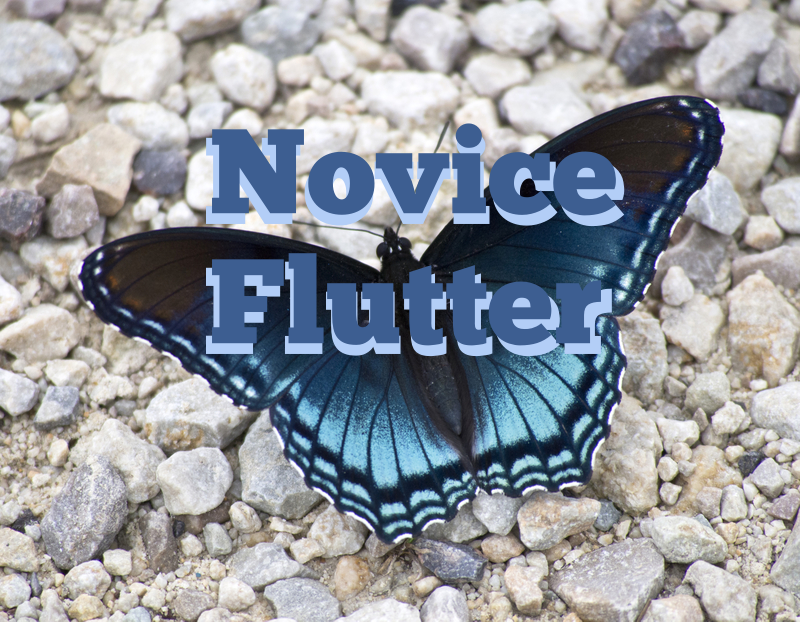

# Novice Flutter

Doing this a bit different. Not the stuff in the Flutter Docs, but the missing stuff that no one is telling you about. Like:

- How to extend ThemeData

- How to Share Scaffolds in the adaptive nav pattern

- How to really glue the jumble of state solution parts so it 
becomes one coordinated full state management solution.

- How to implement full acceptance driven development testing along with behavior driven development within the same exact test setup.

- Adaptive and Responsive Layouts for all screens

But, first I need the code demos. Hence a repo with small code demos that become the center of book chapters.

## Biases

- Domain Driven Design based

- Widget Dependency Injection as it's saving grace despite being 
  putting compile time dependency errors in run-time error buckets is integrated with dev-tools to give enough debug tools during debug testing to make up for that antipattern of confining dependency errors to the run-time bucket.

- BLoC

- Proper logging via actually understanding why log infrastructure should be using the streaming to support real performative application logging in real-time.

- Infusion of Functional Programming to switch from imperative to more composable code both in the business-logic layer, domain layer, and the presentation layers

## Medium Articles

As you await articles, you can view past ones at my medium blog:

[Fred Grott's Medium Blog](https://fredgrott.medium.com)

## Book Work In Process

As I get closer to publication, these will be updated with real websites implement in flutter explaing about aech book and where they will be published and where to buy them.

[Your First Flutter App]

]Flutter Best Practices]

[Category Theory In Dart and Flutter]

[Dart Programming For Designers]

[Flutter Domain Driven Design]

[Flutter CrossPlatform With Flutter Platform Widgets]

[Material Design In Flutter Apps]

Also a Big HINT! Obviously, I am draft writing my book chapters and breaking those up into smaller articles that I publish on medium at my blog:

[Fred Grott's Medium Blog](https://fredgrott.medium.com)

And, not to mention the fact that I publish medium friend free-link-to-view-articles on certain social media platforms.

## About Fred Grott

Having come off of being uncontrolled ADHD sufferer for most of my life, I am now in hyper-drive creating some books about app development. One is about Flutter Best Practices and One is about the Dart computer language.

Places you can follow me at include:

[Fred Grott at keyBase](https://keybase.io/fredgrott)

[Fred Grott at Twitter](https://twitter.com/fredgrott)

[Fred Grott at GitHub](https://github.com/fredgrott)

## Resources

Design:

Material Dessign 3(Material You) Specs
https://m3.material.io/

Nielsen Norman Group, One of the top research groups in UI design. Some of the information is paywalled, but there is still a good foundation of free stuff to view and use.

https://www.nngroup.com/

Donald Norman's Every Day Things
https://archive.org/details/pdfy-9Bb1XUCNFvb5HrMP

Jakob Nielsen's Usability Engineering
https://archive.org/details/usabilityenginee00jak_pv3

A Course In Mastering The Art of Mixing Colors by Betty Edwards
https://archive.org/details/colorbybettyedwa00bett

Josef Mueler's Grid Systems In Graphic Design
https://archive.org/details/GridSystemsInGraphicDesignJosefMullerBrockmann

Letterform archive
https://oa.letterformarchive.org/

Stephen Coles Anatomy Of Type In Six Letters
https://typeanatomy.com/image/640694338958000129

And yes, it's Stephen Cole's website and there are other gems there.

TypeDetai1

https://typedetail.com/

Logo Design Love by David Airey
https://archive.org/details/logodesignlogodesignlove

AIGA Design Archives
https://designarchives.aiga.org/#/home

Mathematics:

Category Lecture Notes And Books Resources
https://www.logicmatters.net/categories/

